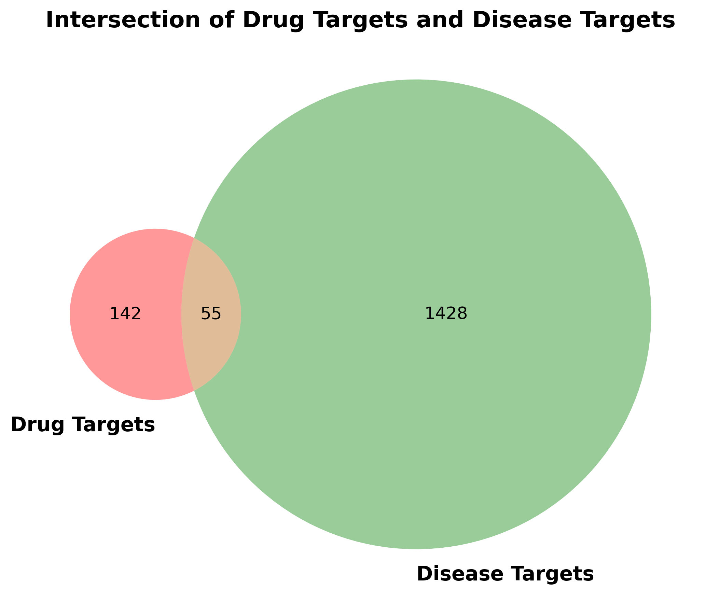
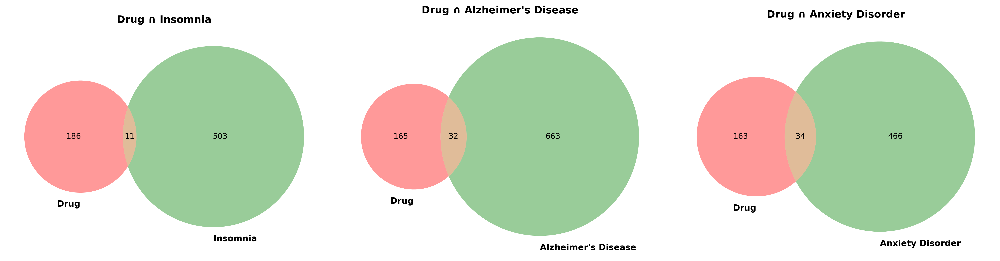
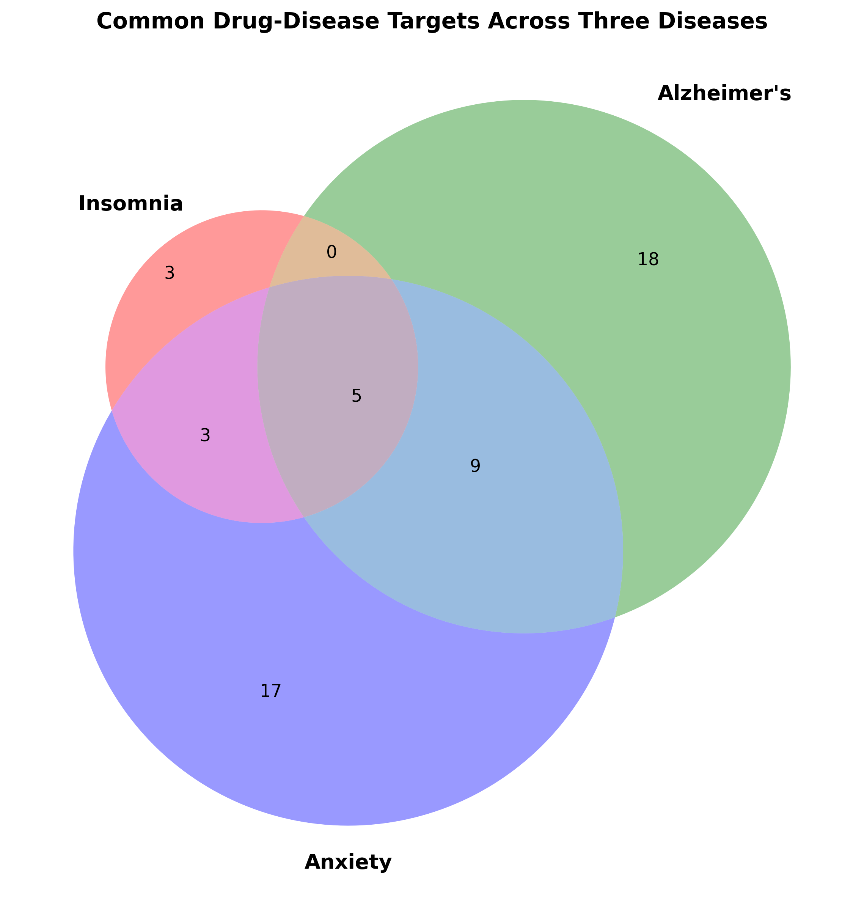
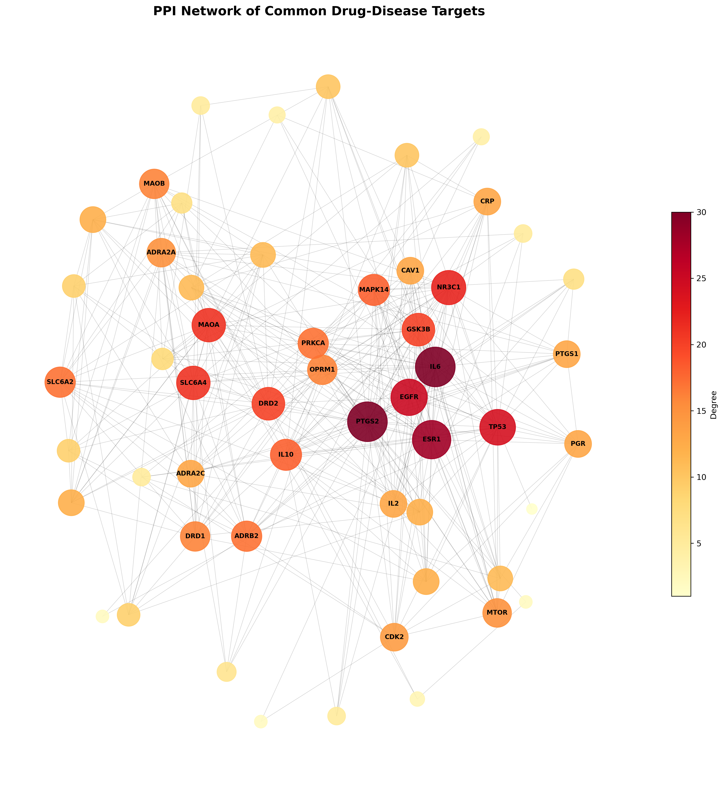
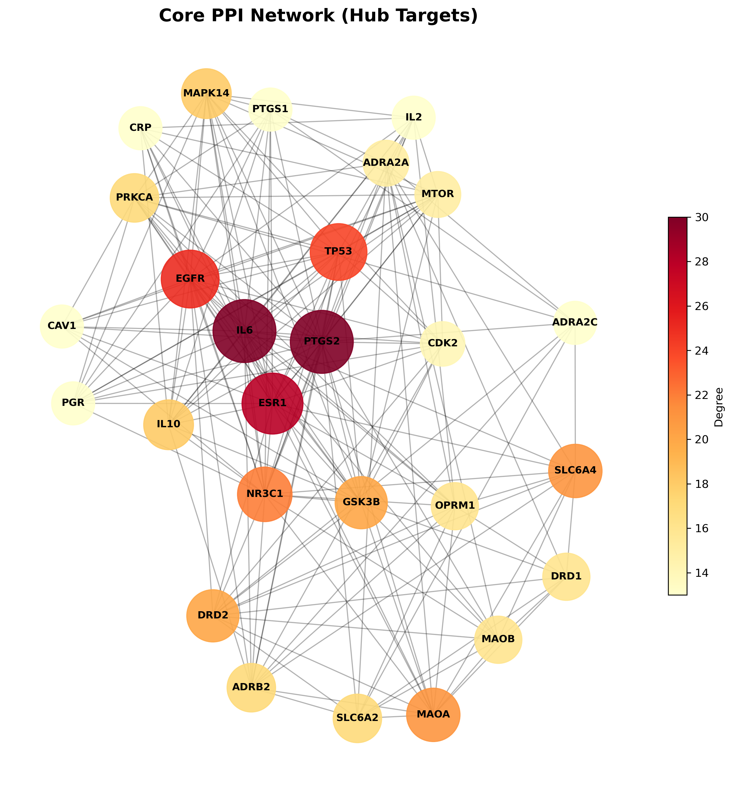
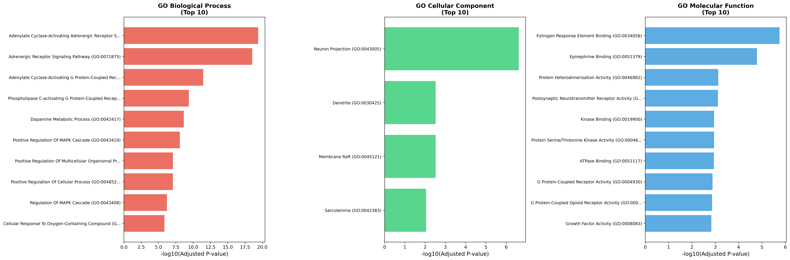
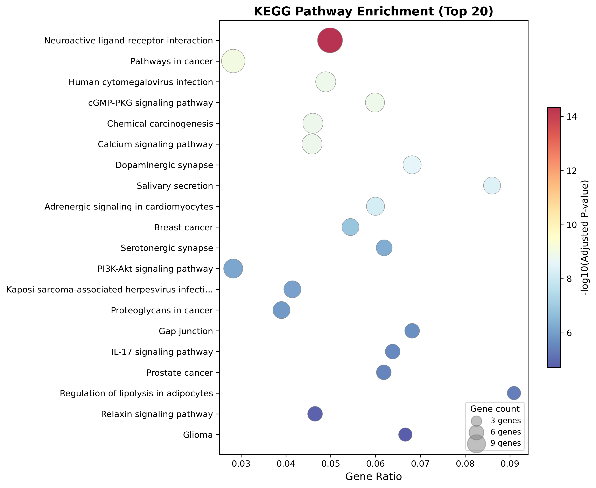
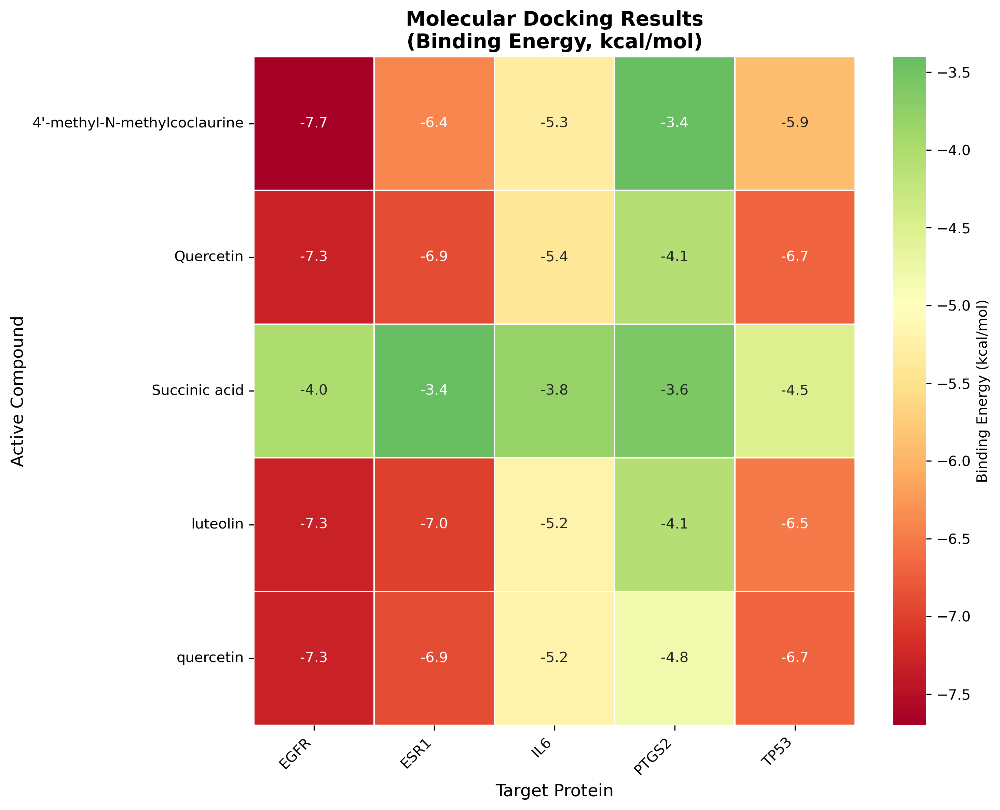

# Network Pharmacology Study of a 健脑安神 (Brain-Nourishing, Mind-Calming) Formula

## Complete Methods and Results Documentation

---

## Overall Pipeline Logic

Network pharmacology asks: **"How does a multi-herb formula treat a disease at the molecular level?"** The pipeline answers this by connecting herbs → compounds → protein targets → disease mechanisms, step by step:

```
Herbs (14) → Active Compounds (145) → Drug Targets (197 genes)
                                              ↓
                              Disease Targets (1,483 genes)
                                              ↓
                                    Common Targets (55 genes)
                                              ↓
                              PPI Network → Core Hubs (27 genes)
                                              ↓
                              GO/KEGG → Key Pathways & Processes
                                              ↓
                              Molecular Docking → Binding Validation
```

Each stage narrows the focus: from thousands of compounds down to the handful of proteins and pathways that most likely explain how this formula works.

---

## 1. Active Compound Screening

**Purpose:** TCM formulas contain hundreds of chemical compounds, but most are not pharmacologically active when taken orally — they may not be absorbed, may be too unlike known drugs, or may be present in trace amounts. This stage identifies the subset of compounds that are most likely to exert therapeutic effects, by filtering for oral bioavailability (can it reach the bloodstream?) and drug-likeness (does it resemble known drugs?).

### 1.1 TCMSP Database Search

**Platform:** TCMSP (Traditional Chinese Medicine Systems Pharmacology Database and Analysis Platform), https://www.tcmsp-e.com/

**Method:** Searched TCMSP for each of the 14 herbs in the formula by their Latin (English) names. For each herb, retrieved all registered chemical ingredients along with their pharmacokinetic properties.

**Herbs searched (14 total):**

| Herb (Chinese) | Search Name in TCMSP | Raw Compounds |
|---|---|---|
| 酸枣仁 | Ziziphi Spinosae Semen | 33 |
| 核桃仁 | Juglandis Semen | 42 |
| 黄精 | Polygonati Rhizoma | 38 |
| 枸杞子 | Lycii Fructus | 188 |
| 桑葚 | Mori Fructus | 91 |
| 当归 | Angelicae Sinensis Radix | 125 |
| 茯苓 | Poria Cocos(Schw.) Wolf. | 34 |
| 莲子 | Nelumbinis Plumula | 31 |
| 百合 | Lilii Bulbus | 84 |
| 益智仁 | Alpiniae Oxyphyliae Fructus | 41 |
| 五味子 | Schisandrae Chinensis Fructus | 130 |
| 山药 | Rhizoma Dioscoreae | 71 |
| 龙眼肉 | *Not in TCMSP — supplemented from literature* | 10 (supplemented) |
| 天麻 | *Not in TCMSP — supplemented from literature* | 11 (supplemented) |

**Note:** 龙眼肉 (Longan Arillus) and 天麻 (Gastrodiae Rhizoma) were not registered in the TCMSP database. Their active compounds were supplemented from published phytochemistry and pharmacology literature, as detailed below.

#### 龙眼肉 (Longan Arillus) — Literature Sources for Active Compounds

The active compounds of longan arillus (Gallic acid, Ellagic acid, Quercetin, Kaempferol, beta-Sitosterol, Adenine, Adenosine, Uridine, Ethyl gallate, Corilagin) were compiled from the following references:

1. **Rangkadilok N, et al.** "Quantification of gallic acid and ellagic acid from longan (Dimocarpus longan Lour.) seed and mango (Mangifera indica L.) kernel and their effects on antioxidant activity." *Food Chemistry*, 2007, 104(3): 1109-1117. DOI: 10.1016/j.foodchem.2007.01.018
   — Reported gallic acid and ellagic acid as major phenolic compounds in longan.

2. **Soong YY, Barlow PJ.** "Isolation and structure elucidation of phenolic compounds from longan (Dimocarpus longan Lour.) seed by high-performance liquid chromatography–electrospray ionization mass spectrometry." *Journal of Chromatography A*, 2005, 1085(2): 270-277. PMID: 16106708
   — Identified gallic acid, ellagic acid, corilagin, quercetin-3-O-rhamnoside, and procyanidins in longan.

3. **Zheng G, et al.** "Chemical constituents from pericarp of longan fruits." *Research Gate*, 2016.
   — Reported β-sitosterol, β-daucosterol, gallic acid, corilagin, and ellagic acid from longan pericarp.

4. **Yang C, et al.** "Longan Arillus: A comprehensive review of botany, traditional uses, phytochemistry, pharmacologic activities, pharmacokinetics, quality control, toxicity, and clinical applications." *Journal of Ethnopharmacology*, 2025. PMID: 40505758
   — Comprehensive review identifying >378 compounds from longan arillus including polyphenols, nucleosides (adenine, adenosine, uridine), and steroids (β-sitosterol).

5. **Prasad KN, et al.** "Extraction and pharmacological properties of bioactive compounds from longan (Dimocarpus longan Lour.) fruit — A review." *Food Research International*, 2009.
   — Reviewed quercetin, kaempferol, and gallic acid as notable antioxidant compounds in longan fruit.

#### 天麻 (Gastrodiae Rhizoma) — Literature Sources for Active Compounds

The active compounds of Gastrodia elata (Gastrodin, 4-Hydroxybenzyl alcohol, Vanillin, 4-Hydroxybenzaldehyde, Vanillyl alcohol, beta-Sitosterol, Parishin A/B/C, Daucosterol, Succinic acid) were compiled from the following references:

1. **Wang YL, et al.** "Neuropharmacological effects of Gastrodia elata Blume and its active ingredients." *Frontiers in Neurology*, 2025, 16: 1574277. DOI: 10.3389/fneur.2025.1574277. PMC: PMC12074926
   — Identified the primary bioactive compounds of Gastrodia elata as gastrodin, p-hydroxybenzyl alcohol (4-Hydroxybenzyl alcohol), vanillyl alcohol, polysaccharides, and β-sitosterol.

2. **Liu Y, et al.** "From molecules to medicine: a systematic review of Gastrodia elata's bioactive metabolites and therapeutic potential." *Frontiers in Pharmacology*, 2025, 16: 1641443. DOI: 10.3389/fphar.2025.1641443
   — Systematic review identifying 143 metabolites including gastrodin, parishins, 4-hydroxybenzaldehyde, vanillin, succinic acid, and sterols (β-sitosterol, daucosterol).

3. **Li YX, et al.** "Isolation, Bioactivity, and Molecular Docking of a Rare Gastrodin Isocitrate and Diverse Parishin Derivatives from Gastrodia elata Blume." *ACS Omega*, 2024, 9(14): 16430-16440. DOI: 10.1021/acsomega.4c00436
   — Isolated parishin A, B, C and novel derivatives; confirmed neuroprotective activity and molecular docking against AD-related targets.

4. **Zhu XL, et al.** "Gastrodin, a Promising Natural Small Molecule for the Treatment of Central Nervous System Disorders, and Its Recent Progress in Synthesis, Pharmacology and Pharmacokinetics." *Current Topics in Medicinal Chemistry*, 2024. PMC: PMC11394983
   — Reviewed gastrodin as the principal active component of Gastrodia elata with neuroprotective, anti-inflammatory, and sedative effects.

5. **Zhan HD, et al.** "The traditional uses, phytochemistry and pharmacology of Gastrodia elata Blume: A comprehensive review." *Arabian Journal of Chemistry*, 2016.
   — Listed gastrodin, p-hydroxybenzyl alcohol, vanillin, 4-hydroxybenzaldehyde, parishin A/B/C, β-sitosterol, daucosterol, and succinic acid as major constituents of Gastrodia elata rhizome.

**Total raw compounds retrieved:** 908 entries (812 unique by MOL_ID)

### 1.2 Compound Filtering

**Filtering criteria (same as reference thesis):**
- Oral Bioavailability (OB) ≥ 30%
- Drug-Likeness (DL) ≥ 0.18

For TCMSP-sourced herbs (12 herbs), the strict OB ≥ 30% and DL ≥ 0.18 filter was applied. For supplementary herbs (龙眼肉, 天麻), a relaxed filter of OB ≥ 30% was used because many of their key bioactive compounds (e.g., Gastrodin, DL=0.06) are small molecules with well-documented pharmacological activity but low DL values.

**Result after filtering:** 160 compound-herb entries, corresponding to **145 unique compounds** across all 14 herbs.

**Per-herb filtered compound count:**

| Herb | Filtered Compounds |
|---|---|
| 枸杞子 | 45 |
| 山药 | 16 |
| 茯苓 | 15 |
| 黄精 | 12 |
| 莲子 | 11 |
| 天麻 | 11 |
| 龙眼肉 | 10 |
| 酸枣仁 | 9 |
| 五味子 | 8 |
| 百合 | 7 |
| 桑葚 | 6 |
| 核桃仁 | 4 |
| 益智仁 | 4 |
| 当归 | 2 |

### 1.3 SMILES Retrieval

**Purpose:** TCMSP provides compound names and pharmacokinetic properties but not machine-readable chemical structures. SMILES (Simplified Molecular Input Line Entry System) is a text notation encoding a molecule's structure as a string (e.g., quercetin = `C1=CC(=C(C=C1C2=C(C(=O)C3=C(C=C(C=C3O2)O)O)O)O)O`). We need SMILES for two downstream steps: (1) Swiss Target Prediction requires SMILES to predict protein targets based on structural similarity to known ligands, and (2) Molecular Docking requires 3D coordinates, which are generated from SMILES using Open Babel.

**Platform:** PubChem (https://pubchem.ncbi.nlm.nih.gov/), accessed via PUG REST API

**Method:** For each unique compound, queried PubChem by compound name to retrieve the Canonical SMILES (Simplified Molecular Input Line Entry System) notation and PubChem CID.

**Result:** 113 out of 145 unique compounds (78%) successfully matched to PubChem entries with valid SMILES. The 30 unmatched compounds were mostly obscure sterols and complex glycosides with non-standard naming.

**Output files:**
- `data/compounds/compounds_filtered_all.csv` — All filtered compounds with SMILES
- `data/compounds/smiles_lookup.csv` — SMILES lookup table

---

## 2. Drug Target Prediction

**Purpose:** Each active compound exerts its effect by physically binding to specific proteins (targets) in the body, altering their function. This stage identifies which human proteins are predicted to interact with our 145 filtered compounds. These "drug targets" represent the molecular entry points through which the formula influences the body. By collecting targets for all compounds across all 14 herbs, we build a comprehensive picture of the formula's potential mechanism of action.

### 2.1 TCMSP Target Retrieval

**Platform:** TCMSP (https://www.tcmsp-e.com/)

**Method:** For each herb page in TCMSP, retrieved the compound-target interaction data (grid2 data). TCMSP provides predicted and validated targets for each compound, including target name, DrugBank ID, and prediction scores (SVM_score, RF_score).

**Result:** 4,000 total compound-target entries from 12 TCMSP-registered herbs. After filtering for only our selected active compounds: **851 entries** involving **249 unique target names**.

### 2.2 Target Supplementation for Missing Herbs

For 龙眼肉 and 天麻, targets were obtained by:
1. Matching shared compounds (e.g., Quercetin, beta-Sitosterol, Ellagic acid) to their TCMSP target data from other herbs
2. UniProt protein database search for remaining unique compounds

**Result:** 541 supplementary target entries added for 龙眼肉 and 天麻.

### 2.3 Gene Symbol Standardization

**Platform:** UniProt (https://rest.uniprot.org/), REST API

**Method:** Each target protein name was queried against UniProt (species: Homo sapiens, organism_id: 9606) to obtain the standardized HGNC gene symbol and UniProt accession ID.

**Parameters:**
- Query: `protein_name:"[target name]" AND organism_id:9606`
- Format: JSON
- Fields: gene_primary, protein_name, accession

**Result:** 173 out of 249 TCMSP target names (69.5%) were successfully mapped to standard gene symbols. After mapping supplementary targets, the final dataset contains:
- **980 compound-target entries**
- **197 unique gene symbols**

**Per-herb target counts:**

| Herb | Unique Gene Targets |
|---|---|
| 莲子 | 143 |
| 枸杞子 | 129 |
| 龙眼肉 | 125 |
| 桑葚 | 108 |
| 黄精 | 63 |
| 天麻 | 57 |
| 百合 | 43 |
| 当归 | 39 |
| 山药 | 32 |
| 酸枣仁 | 26 |
| 益智仁 | 23 |
| 核桃仁 | 16 |
| 茯苓 | 15 |
| 五味子 | 12 |

**Output files:**
- `data/targets/drug_targets.csv` — Full drug target data with gene symbols
- `data/targets/drug_target_genes.csv` — Unique gene symbol list

---

## 3. Disease Target Collection

**Purpose:** To understand how the formula treats the target diseases, we need to know which genes/proteins are involved in those diseases. This stage collects genes that have been linked to Insomnia, Alzheimer's Disease, and Anxiety Disorder through genetic studies (GWAS), clinical evidence, expression data, and literature. These "disease targets" represent the molecular basis of the diseases themselves. Later, by overlapping drug targets with disease targets, we can pinpoint exactly which disease-relevant proteins the formula acts on.

### 3.1 Databases Used

**Platform 1:** Open Targets Platform (https://platform.opentargets.org/), GraphQL API

**Method:** For each disease, queried the Open Targets GraphQL API to:
1. Search for the disease entity ID (EFO/MONDO ontology)
2. Retrieve the top 500 associated target genes ranked by overall association score

**Parameters:**
- Disease search: `queryString: "[disease name]"`, entityNames: ["disease"]
- Target retrieval: `page: {size: 500, index: 0}`

**Disease IDs resolved:**
- Insomnia → EFO_0004698
- Alzheimer's disease → MONDO_0004975
- Anxiety disorder → EFO_0006788

**Platform 2:** NCBI Gene (https://eutils.ncbi.nlm.nih.gov/), E-utilities API

**Method:** Searched NCBI Gene database using the Disease/Phenotype field for each disease name, limited to Homo sapiens.

**Parameters:**
- Database: gene
- Term: `"[disease name]"[Disease/Phenotype] AND Homo sapiens[Organism]`
- retmax: 500

### 3.2 Results

| Disease | Open Targets | NCBI Gene | Total Unique |
|---|---|---|---|
| Insomnia | 500 | 19 | **514** |
| Alzheimer's disease | 500 | 227 | **695** |
| Anxiety disorder | 500 | 0 | **500** |
| **Union (all 3 diseases)** | | | **1,483** |

**Output files:**
- `data/targets/disease_targets.csv` — All disease targets with source and scores
- `data/targets/disease_targets_insomnia.csv` — Insomnia-specific gene list
- `data/targets/disease_targets_alzheimer.csv` — Alzheimer-specific gene list
- `data/targets/disease_targets_anxiety.csv` — Anxiety-specific gene list

---

## 4. Intersection Analysis & Venn Diagram

**Purpose:** This is the central step of network pharmacology — finding the overlap between "what the formula targets" (drug targets) and "what drives the disease" (disease targets). The overlapping genes are the **common targets** — the proteins through which the formula is most likely exerting its therapeutic effects on the diseases. The Venn diagram visualizes how many targets are shared versus unique to each set, and the per-disease breakdown shows whether the formula preferentially targets certain diseases.

### 4.1 Method

Drug target genes (197) were intersected with the union of all disease target genes (1,483) to identify common drug-disease targets. Additional per-disease intersections were computed.

**Tool:** Python (matplotlib-venn package)

### 4.2 Results

| Intersection | Count |
|---|---|
| Drug ∩ All diseases | **55** |
| Drug ∩ Insomnia | 11 |
| Drug ∩ Alzheimer's disease | 32 |
| Drug ∩ Anxiety disorder | 34 |

**All 55 common targets:**
ACHE, ADCY2, ADRA1A, ADRA1B, ADRA1D, ADRA2A, ADRA2B, ADRA2C, ADRB1, ADRB2, ALDH5A1, BCHE, CAV1, CDC25B, CDK2, CDK4, CHRNA2, CRP, DCAF5, DRD1, DRD2, DRD3, DRD4, EGFR, ESR1, ESR2, FOSL1, GABRA6, GSK3B, HTR3A, IL10, IL2, IL6, MAOA, MAOB, MAPK14, ME2, MMP3, MPO, MTOR, NOS1, NR3C1, NUF2, OPRD1, OPRM1, PGR, PRKCA, PTGS1, PTGS2, RUNX1T1, SCN5A, SLC6A2, SLC6A4, TP53, VEGFA

### 4.3 Output Figures

| File | Description |
|---|---|
| **`venn_drug_disease.pdf`** | Drug vs Disease Venn diagram (55 overlap) |
| **`venn_per_disease.pdf`** | Drug vs each disease (3 panels) |
| **`venn_three_diseases.pdf`** | 3-way Venn across three diseases |

**Figure 4.1** Drug Targets vs Disease Targets Venn Diagram
{width=80%}

**Figure 4.2** Drug Targets vs Each Disease
{width=100%}

**Figure 4.3** Common Targets Across Three Diseases
{width=70%}

**Output data:**
- `data/targets/common_targets.csv` — List of 55 common targets

---

## 5. PPI Network Construction & Core Target Selection

**Purpose:** The 55 common targets do not work in isolation — proteins interact with each other in signaling cascades and regulatory networks. By building a protein-protein interaction (PPI) network, we reveal which targets are most "central" or "connected" in the biological network. The most connected nodes (hub targets) are likely the key mediators of the formula's therapeutic effect, because disrupting a hub protein affects many downstream pathways. This step prioritizes the most important targets for further investigation and molecular docking.

### 5.1 STRING Database Query

**Platform:** STRING (Search Tool for the Retrieval of Interacting Genes/Proteins), https://string-db.org/, REST API v11

**Method:** The 55 common target genes were submitted to the STRING API to retrieve protein-protein interaction (PPI) data.

**Parameters:**
- API endpoint: `https://string-db.org/api/json/network`
- Species: 9606 (Homo sapiens)
- Minimum required interaction score: 400 (medium confidence, equivalent to 0.4)
- Isolated nodes (no interactions) were removed

### 5.2 Network Analysis

**Tool:** Python NetworkX library (mimicking Cytoscape CentiScaPe plugin)

**Topology metrics calculated:**
- **Degree** — Number of direct interaction partners
- **Betweenness centrality** — Fraction of shortest paths passing through a node
- **Closeness centrality** — Average inverse distance to all other nodes

**Core target selection:** Nodes with Degree ≥ median Degree (12.5) were classified as core hub targets.

### 5.3 Results

| Metric | Value |
|---|---|
| Total nodes | 54 (2 isolated nodes removed: DCAF5, VEGFA) |
| Total edges | 346 |
| Median Degree | 12.5 |
| Core targets (Degree ≥ 12.5) | **27** |

**Top 10 Core Targets:**

| Rank | Gene | Degree | Betweenness | Closeness |
|---|---|---|---|---|
| 1 | PTGS2 | 30 | 0.087 | 0.688 |
| 2 | IL6 | 30 | 0.082 | 0.697 |
| 3 | ESR1 | 28 | 0.098 | 0.679 |
| 4 | EGFR | 25 | 0.058 | 0.639 |
| 5 | TP53 | 24 | 0.069 | 0.596 |
| 6 | NR3C1 | 22 | 0.040 | 0.631 |
| 7 | MAOA | 21 | 0.054 | 0.609 |
| 8 | SLC6A4 | 21 | 0.057 | 0.609 |
| 9 | DRD2 | 20 | 0.056 | 0.602 |
| 10 | GSK3B | 20 | 0.025 | 0.602 |

### 5.4 Output Figures and Tables

| File | Description |
|---|---|
| **`ppi_network.pdf`** | Full PPI network (54 nodes, 346 edges) |
| **`ppi_core_network.pdf`** | Core hub PPI subnetwork (27 nodes) |
| `ppi_topology.csv` | Topology metrics for all 54 nodes |
| `core_targets.csv` | Core target list (27 genes) |
| `ppi_edges.csv` | Edge list (Cytoscape-importable) |

**Figure 5.1** Full PPI Network (54 nodes, 346 edges)
{width=85%}

**Figure 5.2** Core Hub PPI Subnetwork (27 nodes)
{width=80%}

---

## 6. GO & KEGG Enrichment Analysis

**Purpose:** Knowing the individual target genes is not enough — we need to understand what biological processes and signaling pathways they collectively participate in. GO (Gene Ontology) enrichment reveals the biological processes (e.g., "inflammatory response"), cellular locations (e.g., "synapse"), and molecular functions (e.g., "receptor binding") that are over-represented among our targets. KEGG enrichment identifies specific signaling pathways (e.g., "Dopaminergic synapse", "PI3K-Akt signaling") that are significantly enriched. Together, they explain the higher-level biological mechanisms through which the formula treats the diseases, moving from individual proteins to systems-level understanding.

### 6.1 Method

**Platform:** Enrichr (https://maayanlab.cloud/Enrichr/), accessed via Python gseapy package

**Method:** The 55 common target genes were submitted for:
1. **GO (Gene Ontology) enrichment** — Biological Process (BP), Cellular Component (CC), Molecular Function (MF), using GO_2023 gene sets
2. **KEGG pathway enrichment** — using KEGG_2021_Human gene sets

**Parameters:**
- Organism: human
- Significance threshold: Adjusted P-value (Benjamini-Hochberg) < 0.05

### 6.2 Results

**GO Enrichment:**

| Category | Significant Terms (P.adj < 0.05) |
|---|---|
| Biological Process (BP) | 311 |
| Cellular Component (CC) | 4 |
| Molecular Function (MF) | 34 |

**Top 5 GO Biological Processes:**
1. Adenylate cyclase-modulating G protein-coupled receptor signaling pathway
2. Positive regulation of cytosolic calcium ion concentration
3. G protein-coupled receptor signaling pathway
4. Inflammatory response
5. Response to drug

**KEGG Pathway Enrichment: 147 significant pathways (P.adj < 0.05)**

**Top 20 KEGG Pathways:**

| Rank | Pathway | Adjusted P-value | Gene Count |
|---|---|---|---|
| 1 | Neuroactive ligand-receptor interaction | 4.58e-15 | 17/341 |
| 2 | Pathways in cancer | 8.74e-10 | 15/531 |
| 3 | Human cytomegalovirus infection | 1.38e-09 | 11/225 |
| 4 | cGMP-PKG signaling pathway | 1.38e-09 | 10/167 |
| 5 | Chemical carcinogenesis | 1.53e-09 | 11/239 |
| 6 | Calcium signaling pathway | 1.53e-09 | 11/240 |
| 7 | Dopaminergic synapse | 2.62e-09 | 9/132 |
| 8 | Salivary secretion | 4.23e-09 | 8/93 |
| 9 | Adrenergic signaling in cardiomyocytes | 6.43e-09 | 9/150 |
| 10 | Breast cancer | 1.32e-07 | 8/147 |
| 11 | Serotonergic synapse | 4.65e-07 | 7/113 |
| 12 | PI3K-Akt signaling pathway | 6.61e-07 | 10/354 |
| 13 | Kaposi sarcoma-associated herpesvirus infection | 8.55e-07 | 8/193 |
| 14 | Proteoglycans in cancer | 1.27e-06 | 8/205 |
| 15 | Gap junction | 2.05e-06 | 6/88 |
| 16 | IL-17 signaling pathway | 2.86e-06 | 6/94 |
| 17 | Prostate cancer | 3.24e-06 | 6/97 |
| 18 | Regulation of lipolysis in adipocytes | 4.70e-06 | 5/55 |
| 19 | Relaxin signaling pathway | 1.56e-05 | 6/129 |
| 20 | Glioma | 1.92e-05 | 5/75 |

### 6.3 Output Figures and Data

| File | Description |
|---|---|
| **`go_barplot.pdf`** | GO enrichment bar plots (BP, CC, MF) |
| **`kegg_bubble.pdf`** | KEGG pathway bubble plot (top 20) |
| `GO_Biological_Process_2023.csv` | Full GO-BP results (311 terms) |
| `GO_Cellular_Component_2023.csv` | Full GO-CC results (4 terms) |
| `GO_Molecular_Function_2023.csv` | Full GO-MF results (34 terms) |
| `KEGG_2021_Human.csv` | Full KEGG results (147 pathways) |

**Figure 6.1** GO Enrichment Bar Plot (BP, CC, MF — Top 10 each)
{width=100%}

**Figure 6.2** KEGG Pathway Enrichment Bubble Plot (Top 20)
{width=90%}

---

## 7. Molecular Docking

**Purpose:** The previous stages are all based on database predictions and statistical analysis. Molecular docking provides a physics-based validation by computationally simulating whether the key active compounds can actually fit into the binding pockets of the top target proteins. If a compound shows strong binding energy (< −7.0 kcal/mol), it provides structural-level evidence that the predicted compound-target interaction is physically plausible. This strengthens the confidence in the network pharmacology predictions and identifies the most promising compound-target pairs for future experimental validation (e.g., in vitro binding assays).

### 7.1 Target and Ligand Selection

**Receptors (top 5 core targets by PPI Degree):**

| Target | PDB ID | Description |
|---|---|---|
| PTGS2 | 5IKR | Cyclooxygenase-2 |
| IL6 | 1ALU | Interleukin-6 |
| ESR1 | 1ERE | Estrogen receptor alpha |
| EGFR | 1M17 | Epidermal growth factor receptor |
| TP53 | 1TSR | Tumor protein p53 |

**Ligands (top 5 compounds by number of targets in the network):**

| Compound | Number of Targets |
|---|---|
| Quercetin | 108 |
| Luteolin | 42 |
| 4'-methyl-N-methylcoclaurine | 27 |
| Succinic acid | 27 |

(Note: quercetin/Quercetin appeared twice due to case difference from two herb sources)

### 7.2 Structure Preparation

**Receptor structures:**
- **Source:** RCSB PDB (https://www.rcsb.org/)
- **Processing:** Converted PDB to PDBQT format using Open Babel 3.1 (`obabel -xr` to remove water molecules and add partial charges)

**Ligand structures:**
- **Source:** SMILES from PubChem, converted to 3D coordinates
- **Processing:** SMILES → 3D SDF (Open Babel, `--gen3d -h` for 3D generation and hydrogen addition) → PDBQT format

### 7.3 Docking Protocol

**Software:** AutoDock Vina 1.1.2

**Parameters:**
- Search box size: 25 × 25 × 25 Å (centered on protein center of mass)
- Exhaustiveness: 8
- Number of modes: 3
- Scoring: AutoDock Vina force field

**Binding energy interpretation:**
- < -5.0 kcal/mol: Good binding affinity
- < -7.0 kcal/mol: Strong binding affinity

### 7.4 Results

**Docking Binding Energies (kcal/mol):**

| Compound \ Target | PTGS2 | IL6 | ESR1 | EGFR | TP53 |
|---|---|---|---|---|---|
| Quercetin | -4.8 | -5.4 | -6.9 | **-7.3** | -6.7 |
| Luteolin | -4.1 | -5.2 | **-7.0** | **-7.3** | -6.5 |
| 4'-methyl-N-methylcoclaurine | -3.4 | -5.3 | -6.4 | **-7.7** | -5.9 |
| Succinic acid | -3.6 | -3.8 | -3.4 | -4.0 | -4.5 |

**Key findings:**
- **Strongest binding:** 4'-methyl-N-methylcoclaurine → EGFR (**-7.7 kcal/mol**)
- **Strong bindings (< -7.0):** Quercetin → EGFR (-7.3), Luteolin → EGFR (-7.3), Luteolin → ESR1 (-7.0)
- **Good bindings (< -5.0):** Most flavonoid-target pairs showed good affinity
- **Weak binding:** Succinic acid showed poor affinity with all targets (> -4.5), consistent with its small molecular size

### 7.5 Output Figures and Data

| File | Description |
|---|---|
| **`docking_heatmap.pdf`** | Binding energy heatmap (5 targets x 5 compounds) |
| `docking_results.csv` | All 25 docking results with binding energies |
| `docking/receptors/` | Receptor PDB and PDBQT files |
| `docking/ligands/` | Ligand PDB, SDF, and PDBQT files |
| `docking/*_out.pdbqt` | Docking output poses (best 3 modes per pair) |

**Figure 7.1** Molecular Docking Binding Energy Heatmap
{width=85%}

---

## Summary of All Output Figures (PDF)

1. **venn_drug_disease.pdf** — Drug targets vs Disease targets Venn diagram
2. **venn_per_disease.pdf** — Drug vs each disease (3 panels)
3. **venn_three_diseases.pdf** — 3-way Venn across Insomnia/Alzheimer/Anxiety
4. **ppi_network.pdf** — Full PPI network (54 nodes, 346 edges)
5. **ppi_core_network.pdf** — Core hub PPI subnetwork (27 nodes)
6. **go_barplot.pdf** — GO enrichment bar plots (BP, CC, MF)
7. **kegg_bubble.pdf** — KEGG pathway bubble plot (top 20)
8. **docking_heatmap.pdf** — Molecular docking binding energy heatmap

All figures are located in the `results/figures/` directory, available in both PNG and PDF formats.

---

## Appendix: How Each Calculation Works

### A1. Oral Bioavailability (OB)

OB represents the fraction of an orally administered drug that reaches systemic circulation in unchanged form. In TCMSP, OB (%) is pre-calculated for each compound using the OBioavail 1.1 model, which is a support vector machine (SVM)-based prediction model trained on 805 structurally diverse drugs with known bioavailability data. The model uses molecular descriptors (e.g., P-glycoprotein interactions, CYP450 metabolism, intestinal permeability) to predict the percentage of the oral dose that reaches the bloodstream. A threshold of **OB ≥ 30%** means we keep compounds predicted to have at least 30% bioavailability — i.e., the compound is likely absorbable when taken orally.

### A2. Drug-Likeness (DL)

DL quantifies how "drug-like" a compound is compared to known drugs. TCMSP calculates DL using the Tanimoto coefficient (a similarity metric) between a compound's molecular descriptors and the average descriptors of all drugs in the DrugBank database:

```
DL(A) = (A · B) / (|A|² + |B|² − A · B)
```

where **A** is the molecular descriptor vector of the candidate compound and **B** is the average descriptor vector of all DrugBank drugs. The value ranges from 0 to 1; higher means more drug-like. A threshold of **DL ≥ 0.18** is the conventional cutoff used in most network pharmacology studies, representing compounds that share sufficient structural features with established drugs to be considered pharmacologically relevant.

### A3. STRING Interaction Confidence Score

STRING assigns a combined confidence score (0–1) to each protein-protein interaction, representing the probability that the interaction is biologically meaningful. It integrates evidence from multiple channels:

- **Experimental data** — physical binding assays (e.g., co-immunoprecipitation, yeast two-hybrid)
- **Curated databases** — known interactions from pathway databases (KEGG, Reactome, BioCyc)
- **Text mining** — co-occurrence of protein names in PubMed abstracts
- **Co-expression** — correlated mRNA expression patterns across conditions
- **Genomic context** — gene neighborhood, gene fusion, phylogenetic co-occurrence

Each channel produces a sub-score; the combined score is calculated as:

```
S_combined = 1 − ∏(1 − S_i)
```

where S_i is the individual channel score. We used **score ≥ 0.4** (medium confidence), meaning there is at least moderate evidence from one or more sources that the two proteins functionally interact.

### A4. PPI Network Topology Metrics

Three centrality metrics were calculated using NetworkX (Python) to identify hub targets in the PPI network:

**Degree** — The number of direct interaction partners (edges) for a node. A node with Degree = 30 (e.g., PTGS2) directly interacts with 30 other proteins. Higher degree = more connected = more likely to be a key regulatory node.

**Betweenness Centrality** — Measures how often a node lies on the shortest path between other node pairs:

```
BC(v) = Σ [σ_st(v) / σ_st]  for all pairs s ≠ v ≠ t
```

where σ_st is the total number of shortest paths from node s to node t, and σ_st(v) is the number of those paths passing through v. Normalized to [0, 1]. High betweenness = the protein is a "bridge" or "bottleneck" controlling information flow between different parts of the network. For example, ESR1 (Betweenness = 0.098) sits on ~10% of all shortest paths, suggesting it mediates cross-talk between different signaling modules.

**Closeness Centrality** — Measures how close a node is to all other nodes:

```
CC(v) = (N − 1) / Σ d(v, u)  for all u ≠ v
```

where d(v, u) is the shortest path length between v and u, and N is the number of nodes. High closeness = the protein can quickly influence or be influenced by others. IL6 (Closeness = 0.697) is on average only ~1.4 steps away from any other protein in the network.

**Core target selection:** We selected nodes with Degree ≥ median Degree (12.5) as core hub targets, following the convention used in CentiScaPe analysis in Cytoscape.

### A5. GO and KEGG Enrichment Analysis

Enrichment analysis tests whether certain biological categories (GO terms or KEGG pathways) appear more frequently in our target gene list than expected by chance.

**Fisher's Exact Test (used by Enrichr):**

For each GO term or KEGG pathway, a 2×2 contingency table is constructed:

|  | In pathway | Not in pathway |
|---|---|---|
| **In our gene list** | a | b |
| **Not in our gene list** | c | d |

The P-value is calculated using Fisher's exact test:

```
P = C(a+b, a) × C(c+d, c) / C(a+b+c+d, a+c)
```

This tests the null hypothesis that our genes are NOT enriched in this pathway. A small P-value means the overlap is unlikely by chance.

**Adjusted P-value (Benjamini-Hochberg FDR):** Because we test hundreds of GO terms/pathways simultaneously, we correct for multiple testing. The Benjamini-Hochberg procedure ranks all P-values, then adjusts:

```
P_adjusted(i) = P(i) × (total tests / rank_i)
```

We use **Adjusted P-value < 0.05** as the significance cutoff, meaning we accept a 5% false discovery rate.

**Gene Ratio** (shown in KEGG bubble plot): The fraction of pathway genes present in our list. For example, "17/341" for Neuroactive ligand-receptor interaction means 17 of the 341 genes in that pathway are among our 55 common targets.

### A6. Molecular Docking (AutoDock Vina)

Molecular docking predicts the preferred orientation and binding strength of a small molecule (ligand) within a protein's binding site (receptor).

**How Vina works:**

1. **Search algorithm:** Vina uses an iterated local search global optimizer. It randomly places the ligand in the search box, then iteratively:
   - Mutates the ligand pose (random translation, rotation, torsion angle changes)
   - Locally optimizes using the scoring function gradient
   - Accepts or rejects based on a Metropolis criterion (simulated annealing-like)
   - The `exhaustiveness` parameter (set to 8) controls how many independent runs are performed — more runs = more thorough search.

2. **Scoring function:** Vina's empirical scoring function estimates binding free energy (kcal/mol) as a sum of intermolecular interaction terms:

```
ΔG_bind ≈ ΔG_vdw + ΔG_hbond + ΔG_elec + ΔG_desolv + ΔG_torsion
```

   - **ΔG_vdw** — van der Waals (steric) interactions: attractive at optimal distance, repulsive if too close
   - **ΔG_hbond** — hydrogen bond donor-acceptor interactions
   - **ΔG_elec** — electrostatic (charge-charge) interactions
   - **ΔG_desolv** — desolvation penalty: energetic cost of removing water from the binding interface
   - **ΔG_torsion** — entropy penalty for restricting rotatable bonds upon binding

3. **Output:** The binding energy in kcal/mol. **More negative = stronger binding:**
   - \> −5.0 kcal/mol: Weak or no meaningful binding
   - −5.0 to −7.0 kcal/mol: Moderate (good) binding
   - < −7.0 kcal/mol: Strong binding

   For example, 4'-methyl-N-methylcoclaurine binding to EGFR at −7.7 kcal/mol suggests strong complementarity between the compound's shape/chemistry and the EGFR binding pocket.

4. **Search box:** A 25 × 25 × 25 Å cubic box was centered on the protein's center of mass. This is a "blind docking" approach covering a large area of the protein surface, allowing the ligand to find the most favorable binding site without prior knowledge of the active site location.

### A7. Open Targets Association Score

Open Targets calculates an overall association score (0–1) between a disease and a target gene by integrating evidence from multiple data sources:

- **Genetic associations** — GWAS studies, ClinVar, UniProt variants
- **Somatic mutations** — Cancer-related mutations (COSMIC, IntOGen)
- **Known drugs** — Approved drugs targeting the protein for the disease (ChEMBL)
- **Pathways & systems biology** — Reactome pathway perturbation
- **RNA expression** — Differential expression in disease tissues
- **Literature** — Text-mined co-occurrences in publications
- **Animal models** — Phenotype data from model organisms

Each source produces a sub-score; the overall score is computed by a harmonic sum that weights the strongest evidence most heavily. We retrieved the top 500 targets per disease ranked by this score.

---

## Software and Databases Summary

| Tool/Database | Version/URL | Purpose |
|---|---|---|
| TCMSP | https://www.tcmsp-e.com/ | Active compound screening (OB, DL) and drug targets |
| PubChem | https://pubchem.ncbi.nlm.nih.gov/ (PUG REST API) | SMILES structure retrieval |
| UniProt | https://rest.uniprot.org/ (REST API) | Gene symbol standardization |
| Open Targets | https://platform.opentargets.org/ (GraphQL API) | Disease-associated target genes |
| NCBI Gene | https://eutils.ncbi.nlm.nih.gov/ (E-utilities) | Supplementary disease genes |
| STRING | https://string-db.org/ (REST API v11) | Protein-protein interaction network |
| Enrichr | https://maayanlab.cloud/Enrichr/ (via gseapy) | GO and KEGG enrichment analysis |
| RCSB PDB | https://www.rcsb.org/ | Receptor 3D structures |
| AutoDock Vina | v1.1.2 | Molecular docking |
| Open Babel | v3.1 | Molecular format conversion |
| Python | 3.10 (conda env: ppi) | All scripting |
| NetworkX | Python library | PPI network topology analysis |
| gseapy | Python library | GO/KEGG enrichment |
| matplotlib / seaborn | Python libraries | Visualization |
| matplotlib-venn | Python library | Venn diagrams |

---

## Conda Environment Reproduction

```bash
mamba create -n ppi python=3.10 -y
mamba install -n ppi -y pandas requests beautifulsoup4 matplotlib seaborn networkx openbabel lxml openpyxl
mamba install -n ppi -y -c conda-forge gseapy matplotlib-venn autodock-vina pymol-open-source
```
